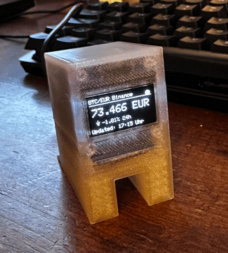

# ESP8266 Bitcoin Live Ticker

Bitcoin price display for Wemos D1 Mini with SSD1306 OLED.

Two versions are included in this project:
1. (Option A) Web Config Version (btc_ticker_websrv.ino) - Recommended
   Allows configuration via WiFi (phone/laptop). No coding changes needed.
2. (Option B) Standard Version (btc_ticker.ino)
   Requires hardcoding WiFi credentials in the code.

## Supported Hardware
| Component | Specification |
|-----------|---------------|
| Microcontroller | **Wemos D1 Mini**, clones, or any standard generic **ESP8266** module (NodeMCU, etc) |
| Display | **0.96" OLED** (I2C, SSD1306, 128x64 resolution) |
| Power | USB (Micro-USB/USB-C) or 5V source |

> **Note on Display Address**: The code uses the default I2C address `0x3C`. Some displays use `0x3D` (often selectable via a solder bridge on the back). If your screen remains blank, check this address and change `#define OLED_I2C_ADDRESS 0x3C` to `0x3D` in the code if needed.

## 3D Printed Case
You can print a case to house the Wemos D1 Mini and OLED display.
*   **Recommended Design**: [Wemos D1 Mini Case](https://www.thingiverse.com/thing:2884823) by **Qrome**.
    *   *License*: Creative Commons - Attribution - Non-Commercial.
*   **Alternatives**: There are many other excellent designs available on [Thingiverse](https://www.thingiverse.com/search?q=wemos+d1+mini+oled&type=things&sort=relevant) and [Printables](https://www.printables.com/search/models?q=wemos%20d1%20mini%20oled).

## Wiring Diagram
| Wemos D1 Mini | SSD1306 (OLED) |
|---------------|----------------|
| 3.3V | VCC |
| GND | GND |
| D1 (GPIO5) | SCL |
| D2 (GPIO4) | SDA |

Note: Use 3.3V for the OLED power.

### Optional Factory Reset Button
You can connect a momentary push button to perform a factory reset without a computer (Web Config Version only).

| Wemos D1 Mini | Momentary Button |
|---------------|------------------|
| D5 (GPIO14) | Pin 1 |
| GND | Pin 2 |

**Usage**: Hold the button for **10 seconds** to trigger the factory reset. A countdown will appear on the display.

---

## Option A: Web Config Version (Recommended)
File: btc_ticker_websrv.ino

This version creates a WiFi hotspot for setup. All settings are saved permanently on the device.

### Features
- Configure WiFi, Currency, and Alerts via web browser
- Data persists after power loss (saved to flash memory)
- Automatic fallback to Setup Mode if WiFi fails

### How to Use
1. Upload btc_ticker_websrv.ino to your ESP8266.
2. Power on the device. It will display a "SETUP MODE" screen.
3. On your phone/computer, connect to the WiFi network:
   SSID: BTC-Ticker-Setup
   (No password)
4. A configuration page should open automatically.
   If not, open a browser and go to: http://192.168.4.1
5. Enter your settings:
   - WiFi SSID and Password
   - Currency (EUR, USD, GBP, etc.)
   - Poll Interval (default 60000ms = 60s)
   - Time Format (DE=24h, US=12h)
   - Alert Thresholds (Price Low/High)
6. Click "Save & Reboot".

### Configuration Options
| Setting | Description |
|---------|-------------|
| Currency | Fiat currency for price display (EUR, USD, etc.) |
| Poll Interval | How often to fetch new data in milliseconds |
| Time Format | DE (14:30 Uhr) or US (2:30 PM) |
| Alert Low/High | Blinks display if price crosses these values |
| Blink Interval | Speed of blinking during alert |
| Flip Display | Rotates screen 180 degrees (for inverted mounting) |

### Resetting the Device (Web Config Version Only)
The instructions below apply to the **Web Config Version** where settings are stored in memory.

If you need to wipe your settings (WiFi, etc.) to start over, you have three options:

**Method 1: Serial Monitor (Soft Reset)**
1. Connect via USB and open Serial Monitor (115200 baud).
2. Reset the device.
3. Within the first 3 seconds, type `wipe` or `w` and press Enter.
4. The device will format its storage and restart in Setup Mode.

**Method 2: Arduino IDE (Hard Reset)**
1. In Arduino IDE, go to **Tools -> Erase Flash**.
2. Select **All Flash Contents**.
3. Re-upload the sketch.

**Method 3: Hardware Button (Optional)**
You can connect a momentary push button between **D5** and **GND**.
- **Usage**: Hold the button for **10 seconds**.
- **Visuals**: The screen will show a countdown.
- **Result**: Device formats storage and restarts.

**Automatic Fallback:**
If the device cannot connect to your saved WiFi (e.g. password changed), it will automatically restart the `BTC-Ticker-Setup` hotspot so you can update configuration.

---

## Option B: Standard Version
File: btc_ticker.ino

This version is simpler but requires you to edit the code to change settings.

### How to Use
1. Open btc_ticker.ino in Arduino IDE.
2. Edit the configuration section at the top of the file:
   
   // Network Settings
   const char* WIFI_SSID = "YOUR_WIFI_SSID";
   const char* WIFI_PASSWORD = "YOUR_WIFI_PASSWORD";

   // App Settings
   #define CURRENCY "EUR"
   #define TIME_FORMAT "DE"
   #define ALERT_PRICE_LOW 90000
   #define ALERT_PRICE_HIGH 110000
   #define FLIP_DISPLAY 0 // Set to 1 to rotate screen 180 degrees

3. Upload to the device.

---

## Display Layout

The display shows information in the following format:

+--------------------------+
| BTC/USD Binance   [WiFi] |  <- Header: Pair + Provider
|--------------------------|
|                          |
|       98.234 USD         |  <- Price (Centered)
|                          |
|  ^ +2.45% 24h            |  <- Trend Arrow + 24h Change
| Updated: 14:30 Uhr       |  <- Last Update Time
+--------------------------+

indicators:
- [WiFi]: Dot icon indicates connection status
- OLD: Appears in header if data is stale (API failure)
- Provider: Shows Binance or CoinGecko

## API Information

Primary Provider: Binance (USDT/EUR pairs)
Secondary Provider: CoinGecko (Fallback)

The device automatically switches to the secondary provider if the primary one fails.

## Troubleshooting

| Issue | Solution |
|-------|----------|
| Display Blank | Check wiring (SDA/SCL) and power (3.3V) |
| No WiFi (Web Version) | Device will start AP mode. Connect to BTC-Ticker-Setup |
| CoinGecko Error | Increase poll interval (max 50 requests/min) |
| Invalid Input | Check Serial Monitor for JSON parsing errors |
